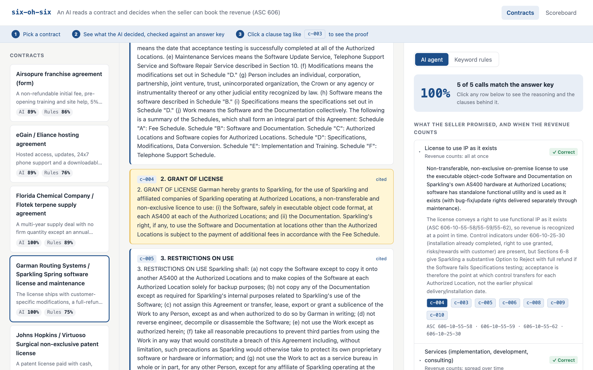
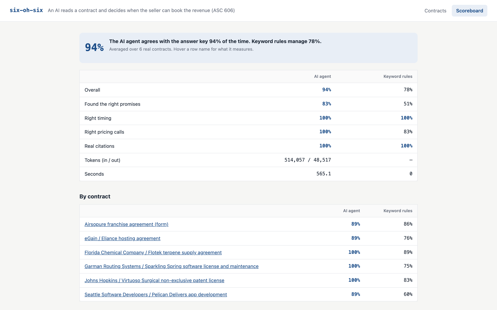
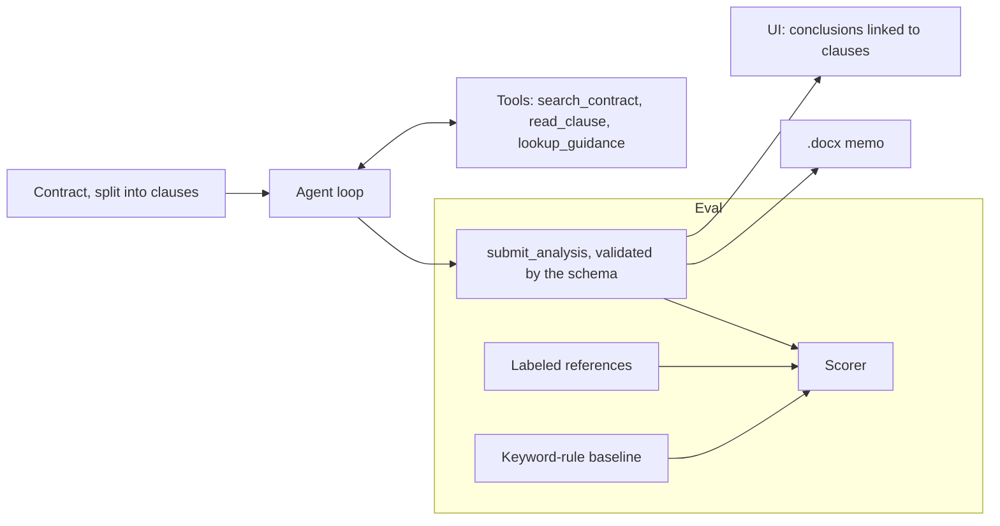

# six-oh-six

**An AI technical accountant for ASC 606. It reads the contract, cites the clause, drafts the memo, and grades itself.**

Every software license, hosting deal and franchise agreement eventually lands on a technical accountant's desk with one question: *when does this revenue count?* The answer lives in the fine print. Is the license something the customer runs on their own servers, or hosted access? Is the royalty variable consideration, or does the royalty exception apply? Are training and implementation separate promises, or one integrated build?

six-oh-six works through that question on real contracts filed with the SEC. A tool-using agent reads the contract clause by clause, applies the five steps of ASC 606 from the seller's side, and cites the exact clauses and guidance paragraphs behind every conclusion. It then drafts a Word memo in the format an auditor expects. An eval harness grades each analysis against labeled answers, because a conclusion someone has to defend to an auditor should be measured, not trusted.





## Results

Six real contracts from the [CUAD](https://www.atticusprojectai.org/cuad) dataset, scored against draft labels (see [Labels](#labels)).

| | Keyword rules | Agent |
| --- | --- | --- |
| **Overall** | 0.78 | **0.94** |
| Performance obligations (F1) | 0.51 | **0.83** |
| Timing, on matched obligations | 1.00 | 1.00 |
| Consideration (variable, royalty exception) | 0.83 | **1.00** |
| Grounding (cited clauses that exist) | 1.00 | 1.00 |

The agent used 514k input and 49k output tokens across all six contracts. It took 70 to 115 seconds per contract.

**Where it still fails.** Every miss is the same one: the agent splits promises that the labels treat as a single obligation. It separated support from hosting in the hosting agreement. It separated the franchise's training and site help from the brand license. It split the app build into two services. The hard part of ASC 606 is deciding what is *distinct in the context of the contract*, and that is also where the labels themselves are most debatable. Those judgment calls are flagged in `reference.json`.

**Where rules fail.** Keyword rules see "license" and call it a license, whatever the contract actually grants. They flag "fee" anywhere as variable pricing. They cannot tell hosted access from software the customer runs, or a patent license from a training clause.

## What it does

- **Reads like an accountant.** The agent starts with only the clause index and must search, read clauses and look up guidance before it concludes. It can only cite clauses it actually read.
- **Classifies every promise** as hosted access, a functional or symbolic license, support, services or goods. It sets timing (over time or at a point in time) and checks consideration for variable terms and the sales-based royalty exception.
- **Shows its work.** Each conclusion links to its clauses. Click one and it lights up in the contract. The full agent trace is one click away. Clause ids the model invents are kept and struck through, not silently dropped.
- **Asks instead of guessing.** Calls the contract doesn't settle go to "open questions" for a human.
- **Drafts the memo.** It writes a `.docx` with purpose, background, the five-step analysis, conclusions, and an appendix quoting every cited clause. See [`docs/sample-memo.docx`](docs/sample-memo.docx).
- **Grades itself** against labels and a keyword-rule baseline, so any change to the prompt, tools or model shows up as a number.

## How it works



- `sixohsix/schema.py` defines the data. `Case` is a contract split into `Clause`s. `Analysis` is what a runner concludes. `Reference` is the label. `KINDS` is the single table of obligation types that the UI, baseline and memo all read.
- `sixohsix/agent.py` is the tool-use loop. It gets the clause index up front, not the full text, so retrieval matters. The prompt is cached across turns. The last turn forces `submit_analysis`, and invalid submissions go back to the model as errors to fix.
- `sixohsix/guidance.py` holds ASC 606 topics as paragraph references plus plain-language summaries written for this project. No FASB text is included.
- `sixohsix/retrieval.py` is a small BM25 over clauses, standard library only.
- `sixohsix/baseline.py` is the spreadsheet approach: a table of keyword rules.
- `sixohsix/score.py` is pure scoring, covered by `pytest`. Obligation F1 over the multiset of kinds, timing on matched kinds, consideration flags, and grounding. `overall = mean(F1, timing, consideration) × grounding`, so an answer built on invented clauses can't score well.
- `sixohsix/memo.py` renders the `.docx`. `sixohsix/server.py` and `sixohsix/web/` are the UI: FastAPI, plain JavaScript, no build step.

## The cases

| Case | The judgment call |
| --- | --- |
| `egain-hosting` | Hosting, updates, support and a downloadable piece: one hosted service or several? |
| `garman-license-maintenance` | On-prem license with custom changes, a full-refund rejection right, then maintenance. |
| `jhu-patent-royalty` | Cash, equity, a 4% royalty, minimums and an exit fee. Only the royalty gets the exception. |
| `ssd-app-development` | Milestone billing vs one integrated build recognized over time. |
| `airsopure-franchise` | A symbolic brand license, sales-based fees, an initial fee and a required product order. |
| `fcc-terpene-supply` | A framework supply deal with only an annual minimum, priced at cost plus margin. |

## Labels

The reference answers are **hand-labeled drafts** made from the contract text. They are not the filers' own accounting, and they have not yet been reviewed by a CPA. Each label names the clauses it rests on and gives a one-line rationale, so you can dispute it. Genuinely ambiguous calls are marked "judgment call". Treat the scores as a measure of agreement with these labels, not as ground truth. Corrections are welcome.

## Quickstart

```bash
python3 -m venv .venv && source .venv/bin/activate
pip install -e '.[dev]'
six-oh-six serve             # http://localhost:8606, uses the committed results
six-oh-six eval --runner all # re-run both runners, rewrite data/results
six-oh-six memo garman-license-maintenance -o memo.docx
pytest
```

Without an API key, `eval` runs the keyword baseline only, and the UI shows the committed agent results.

| Variable | Purpose |
| --- | --- |
| `ANTHROPIC_API_KEY` | Enables the agent in `eval` and the "Run AI agent" button. |
| `SIXOHSIX_MODEL` | Model id for the agent. Defaults to `claude-sonnet-5`. |
| `SIXOHSIX_DATA` | Alternate data root, used by the tests' fixture case. |

## Adding a contract

1. Download [CUAD v1](https://zenodo.org/records/4595826) and register the contract's file in `CASES` in `scripts/import_cuad.py`.
2. Run `python scripts/import_cuad.py path/to/CUAD_v1/full_contract_txt` to split it into clauses.
3. Fill in the `case.json` metadata. `reporting_entity` is the seller whose revenue you analyze. Then write `reference.json`.
4. Run `python scripts/check_cases.py`, then `six-oh-six eval`.

## Data and license

Contracts come from the Contract Understanding Atticus Dataset (CUAD) by The Atticus Project, licensed [CC BY 4.0](https://creativecommons.org/licenses/by/4.0/), originally filed on SEC EDGAR. Sources for each case are in [`data/SOURCES.md`](data/SOURCES.md). Code is MIT.

This is a research prototype, not accounting advice.
